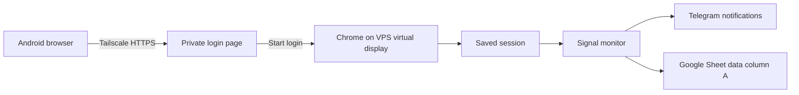

# Ubuntu VPS setup

This installs the monitor and a private TradingView login page on a new
**Ubuntu 24.04 LTS x86-64 VPS**. The commands use `/opt/tradingview-scraper`
and your existing `ubuntu` user with sudo access. Start with 2 vCPUs and 4 GB RAM;
watch actual usage after enabling your configured feeds and adjust if needed.

The monitor runs continuously under systemd. Chrome, a virtual display, and
VNC start only when you press **Start login**. You can complete TradingView
login from Android through noVNC, then the display closes automatically.
Tailscale Serve provides private HTTPS access. No public domain is required.



## 1. Prepare the server

Buy an x86-64 Ubuntu 24.04 VPS, configure an SSH key, and connect as `ubuntu`.
Run the commands below from that account; use `sudo` where shown for
administrator access. Keep the current SSH session open while setting
up networking. If your SSH port differs from 22, adjust the firewall rule.

```bash
sudo apt update
sudo apt upgrade -y
sudo apt install -y ca-certificates curl git xz-utils nano ufw \
  xvfb xauth x11vnc novnc websockify openbox fonts-liberation
sudo ufw allow OpenSSH
sudo ufw enable
```

Keep **6080, 6081, and 5901 closed** in UFW and your provider's firewall.
The login page, desktop proxy, and VNC server bind only to localhost. Tailscale
handles private access; these ports do not need public forwarding.

## 2. Install Node.js 24 and Chrome

Use the official Node.js 24 Linux x64 distribution. The following downloads
the current v24 archive, verifies its SHA-256 checksum, and installs it at
`/usr/local/bin/node`, the path used by the supplied service files.

```bash
(
set -e
mkdir -p /tmp/tradingview-node-install
cd /tmp/tradingview-node-install
curl -fsSLO https://nodejs.org/dist/latest-v24.x/SHASUMS256.txt
TV_NODE_ARCHIVE=$(awk '$2 ~ /^node-v24\.[0-9]+\.[0-9]+-linux-x64.tar.xz$/ {print $2; exit}' SHASUMS256.txt)
test -n "$TV_NODE_ARCHIVE"
curl -fsSLO "https://nodejs.org/dist/latest-v24.x/$TV_NODE_ARCHIVE"
sha256sum --check --ignore-missing SHASUMS256.txt
sudo tar -xJf "$TV_NODE_ARCHIVE" -C /usr/local --strip-components=1 --no-same-owner
/usr/local/bin/node --version
/usr/local/bin/npm --version
)
```

Stop if download or checksum verification fails. See the
[official Node.js downloads](https://nodejs.org/en/download) for updated releases.

Install Google's system Chrome package. It brings its Ubuntu dependencies
and sandbox with it; the browser runs as the non-root `ubuntu` user.

```bash
curl -fL -o /tmp/google-chrome-stable_current_amd64.deb \
  https://dl.google.com/linux/direct/google-chrome-stable_current_amd64.deb
sudo apt install -y /tmp/google-chrome-stable_current_amd64.deb
/usr/bin/google-chrome-stable --version
```

The `.env` below selects this Chrome installation, so Puppeteer's bundled
browser download is unnecessary. Keep Chrome's sandbox enabled. Do not add
`--no-sandbox` or launch Chrome as root. Ubuntu's AppArmor restrictions can
affect separately downloaded browser binaries; using the installed Chrome
package avoids having to disable AppArmor globally.
[Chrome installation](https://support.google.com/chrome/answer/95346),
[Puppeteer sandbox guidance](https://pptr.dev/troubleshooting).

## 3. Deploy this checkout

Deploy a revision that includes this document and the `deploy/` directory.
If your latest changes are still local, push them to your repository or upload
this checkout first. The commands below clone the GitHub revision; they do not
upload uncommitted local changes.

```bash
sudo install -d -m 750 -o ubuntu -g ubuntu /opt/tradingview-scraper
git clone \
  https://github.com/anurag-roy/tradingview-scraper.git /opt/tradingview-scraper
env PUPPETEER_SKIP_DOWNLOAD=true \
  /usr/local/bin/npm ci --prefix /opt/tradingview-scraper
cp /opt/tradingview-scraper/.env.example /opt/tradingview-scraper/.env
chmod 600 /opt/tradingview-scraper/.env
mkdir -m 700 /opt/tradingview-scraper/.auth
```

Reuse your existing `ubuntu` account; no additional Linux user is needed.
If the destination already contains a checkout, reuse it rather than cloning
into a populated directory. All runtime commands, session files, and monitor
state must belong to `ubuntu`.

## 4. Connect Tailscale

Install Tailscale on the VPS and follow the authentication URL:

```bash
curl -fsSL https://tailscale.com/install.sh | sh
sudo tailscale up
sudo tailscale serve --bg http://127.0.0.1:6080
```

The final command may ask you to enable HTTPS for your Tailscale network.
It prints an address such as `https://your-vps.your-network.ts.net`.
Save that exact HTTPS origin for `LOGIN_PUBLIC_URL` below. It is normal for
the page to be unavailable until you start the login service in step 7.

Use **Serve** for this private page. Do not enable public Funnel access.
The application checks the identity header supplied by Serve and accepts only
the account configured in `LOGIN_ALLOWED_EMAIL`; local processes on the VPS
are part of this trust boundary. If you share the VPS or your Tailscale network,
keep its access rules restricted to the intended owner. If Serve is already
configured on this machine, inspect `sudo tailscale serve status` before replacing
its root route.

On Android, install Tailscale from Google Play, sign in to the same network,
accept the VPN configuration, and enable it. The login URL works over Wi-Fi
or mobile data while Tailscale is connected. Configure unattended-server key
expiry in the Tailscale admin console as appropriate; Tailscale authentication
is separate from TradingView authentication.
[Linux installation](https://tailscale.com/docs/install/linux),
[Android installation](https://tailscale.com/docs/install/android),
[Serve and access controls](https://tailscale.com/docs/features/tailscale-serve).

## 5. Configure Google Sheets, Telegram, and the app

In your Google Cloud project, enable the Google Sheets API, create a service
account and download its JSON key. Share your configuration spreadsheet with
that service account as **Editor**, and create a tab named `data`. The app
reads `config!A1:E8` and appends each successfully sent Telegram signal message
to column A of `data`; see
[README.md](README.md#google-sheet-configuration) for the six instrument slots
and timeframe columns. The email/password rows can stay blank; you can type
your TradingView credentials in the remote Chrome window.

Copy the service-account JSON from your computer to the `ubuntu` account
on the VPS, then install it privately. Replace the source path below:

```bash
sudo install -m 600 -o ubuntu -g ubuntu \
  /path/to/uploaded-service-account.json \
  /opt/tradingview-scraper/.auth/google-service-account.json
```

Create a Telegram bot using **@BotFather**, save its token, and start a chat
with the bot or add it to your chosen group. Give it permission to send messages.
Set the bot token in `.env` before using the chat-ID command below.

Edit the configuration:

```bash
nano /opt/tradingview-scraper/.env
```

Populate these values; replace the placeholders with your own:

```dotenv
PUPPETEER_EXECUTABLE_PATH=/usr/bin/google-chrome-stable
GOOGLE_SHEET_ID=https://docs.google.com/spreadsheets/d/YOUR_SHEET_ID/edit
GOOGLE_SERVICE_ACCOUNT_JSON=./.auth/google-service-account.json
CONFIG_TAB=config
TELEGRAM_BOT_TOKEN=YOUR_BOT_TOKEN
TELEGRAM_CHAT_ID=YOUR_CHAT_ID
DAY_OPEN_TIME=03:30
DAY_END_TIME=02:00
SESSION_CHECK_INTERVAL_SECONDS=600
LOGIN_PUBLIC_URL=https://your-vps.your-network.ts.net
LOGIN_ALLOWED_EMAIL=your-tailscale-sign-in-email@example.com
LOGIN_TIMEOUT_SECONDS=1200
LOGIN_PORT=6080
LOGIN_DESKTOP_PORT=6081
LOGIN_VNC_PORT=5901
```

Use the exact Tailscale login identity for `LOGIN_ALLOWED_EMAIL`, not the
TradingView email. `LOGIN_PUBLIC_URL` must contain no path, query, or fragment.
Leave `TRADINGVIEW_SESSION` and `TRADINGVIEW_SESSION_SIGN` blank: `.env` session
overrides would prevent the monitor from using refreshed browser cookies.
TradingView username/password are optional; manual entry is supported.

`03:30`–`02:00` monitors from 03:30 AM IST through 02:00 AM the next day.
The trading day and Sheet notifications reset at the next 03:30 AM opening,
preserving after-midnight messages with the session that started them.
`00:00`–`24:00` is also supported for a full calendar day. Restart the monitor
after changing the spreadsheet or `.env`.

To find your chat ID, send a message to the bot first, then run this **read-only**
request. It prints chat IDs without printing the token or message contents:

```bash
cd /opt/tradingview-scraper
/usr/local/bin/node --env-file=.env --input-type=module <<'JS'
try {
  const response = await fetch(`https://api.telegram.org/bot${process.env.TELEGRAM_BOT_TOKEN}/getUpdates`, {
    signal: AbortSignal.timeout(10000), redirect: 'error',
  });
  const body = await response.json();
  if (!response.ok || !body.ok) throw new Error();
  const chats = new Map();
  for (const update of body.result) {
    const chat = (update.message || update.channel_post || update.my_chat_member)?.chat;
    if (chat) chats.set(chat.id, { id: chat.id, type: chat.type });
  }
  console.log([...chats.values()]);
} catch { console.error('Could not read Telegram updates. Check the token and bot setup.'); process.exitCode = 1; }
JS
```

Choose the intended destination and put its numeric ID in `.env`. For a bot
already connected to a webhook/another consumer, `getUpdates` may be unavailable
or empty; use that existing integration to find the ID rather than deleting its
webhook. [Telegram getUpdates documentation](https://core.telegram.org/bots/api#getupdates).

Validate the actual spreadsheet access:

```bash
cd /opt/tradingview-scraper
/usr/local/bin/npm run config
```

## 6. Create the screen-access password

```bash
x11vnc -storepasswd /opt/tradingview-scraper/.auth/vnc.passwd
chmod 600 /opt/tradingview-scraper/.auth/vnc.passwd
```

Choose a VNC password separate from your TradingView password. Classic VNC
authentication uses only the first eight characters; private Tailscale HTTPS
and the owner identity check provide the network access boundary. Do not put
this password in a URL. You enter it in noVNC when connecting to the display.

## 7. Install and start both systemd services

```bash
sudo cp /opt/tradingview-scraper/deploy/tradingview-monitor.service /etc/systemd/system/
sudo cp /opt/tradingview-scraper/deploy/tradingview-login.service /etc/systemd/system/
sudo systemd-analyze verify /etc/systemd/system/tradingview-{monitor,login}.service
sudo systemctl daemon-reload
sudo systemctl enable --now tradingview-login.service tradingview-monitor.service
sudo systemctl status tradingview-login.service tradingview-monitor.service
```

Both services run as `ubuntu` and use the `.env` file directly through Node.
No shell environment or interactive SSH session is required. The monitor's
candle/notification state remains under `.state/live`. Its process lock lives in systemd's private
`/run/tradingview-monitor` directory, which is recreated on service restart
and reboot. A crashed process does not leave a permanent boot-blocking lock.
systemd stops the entire process group before restarting either service.

Before the first login, the monitor stays running in `login-required` state
and attempts one Telegram notification with your private login link. Repeated
checks and service restarts do not repeat that incident's notification.

## 8. Complete login from Android

1. Enable Tailscale on your phone.
2. Open `LOGIN_PUBLIC_URL` in Chrome, preferably directly rather than Telegram's
   embedded browser.
3. Tap **Start login**. You can select **Start a fresh TradingView sign-in** if
   switching accounts or replacing a stale browser login.
4. Connect to the displayed VPS browser and enter the VNC password.
5. Submit TradingView's login form and complete any CAPTCHA or 2FA. Use noVNC's
   sidebar keyboard button to type; landscape orientation or **Open full screen**
   can make the desktop easier to use.
6. The browser closes after the session is verified and saved. The page says
   **Login saved**, and the monitor picks up the file within roughly five
   seconds, plus the authentication request and stream loading time.

The page remains available while Chrome is closed, so you can open a new login
session later without SSH. Browser sessions have a 20-minute login timeout by
default. **Close session** cancels login and stops the temporary display tools;
simply closing your phone's tab does not immediately cancel the session.

## 9. Observe data and delivery

```bash
sudo journalctl -u tradingview-monitor.service -f
```

Look for `Session health: healthy` and actual `stream_ready`/candle output.
You can separately inspect live TradingView data without sending Telegram:

```bash
cd /opt/tradingview-scraper
/usr/local/bin/npm run preview -- --inspect --seconds 40
```

Preview state is separate from live state. Do not start a second live monitor
while the systemd service is running. Confirm actual Telegram receipt: a first
login incident should produce a login-required message followed by a
login-restored message, and qualifying candles should produce signal messages.
The app records one attempt for each notification; it does not retry failed
or uncertain Telegram deliveries. Confirm that each sent signal also appears
verbatim in column A of `data`. Sheet-write outcomes are recorded separately
in the candle's `sheet` field and in `sheet_result` events. Failed or uncertain
Sheet writes are not retried and do not stop later Telegram alerts.
Older-session and undated messages are removed from column A at startup and
each 03:30 AM rollover. Existing current-session messages are preserved.

## Session expiry and recovery

- The monitor checks the authenticated TradingView account every ten minutes,
  and rechecks after collector errors. The interval is configurable.
- It checks for a new saved session every five seconds. A healthy session change
  also reconnects the collector, so switching accounts takes effect promptly.
- Missing cookies, HTTP 401, and explicitly anonymous quote tokens require login.
  Confirmed login loss pauses collection and unstarted signal sends. One login
  notification is reserved persistently before its Telegram request.
- HTTP 403, rate limits, server errors, malformed/short-lived tokens, and network
  failures are treated as unavailable checks and retried after 30 seconds.
  An already authenticated stream can continue through a failed probe. These
  errors alone do not prove the browser login has expired.
- After successful login validation, the app sends one login-restored notification
  and reconnects automatically during the configured monitoring hours. The
  notification confirms authentication; stream loading can still fail separately.
- The current monitor evaluates unprocessed candles from the current trading
  window after reconnecting, including after login recovery. Previously attempted
  messages are not resent. See [signal-monitor.md](docs/signal-monitor.md).
- Cookie expiry metadata is retained but is not used as proof of current access.
  TradingView can revoke sessions earlier. Short-lived quote-token expiry does
  not itself require a manual login.

This uses TradingView's unofficial web/session interface, which can change.
An unexpected authentication response is reported as unavailable rather than
guessing that your login expired. Observe the real VPS's network behavior before
depending on unattended operation.

## Operations and troubleshooting

```bash
sudo journalctl -u tradingview-login.service -n 100 --no-pager
sudo journalctl -u tradingview-monitor.service -n 100 --no-pager
sudo tailscale serve status
sudo ss -ltnp
sudo systemctl restart tradingview-login.service tradingview-monitor.service
```

- **Page returns 403:** check Android's Tailscale connection, exact
  `LOGIN_ALLOWED_EMAIL`, and that you are using Serve's HTTPS URL. Do not run
  the production service with `--local`; local mode deliberately skips the
  Tailscale identity check and is only for access on the local computer.
- **Start login fails:** check `.auth/vnc.passwd`, installed display packages,
  ownership, and `.auth/remote-login.log`. That private file is overwritten for
  each session. Missing display dependencies do not affect the monitor.
- **Black screen / disconnected display:** inspect the private login log and
  service journal. The display also disconnects normally after successful login
  or the timeout. Start a new session rather than trying to reuse a closed one.
- **Chrome sandbox error:** confirm Chrome is installed at the configured path
  and the login service runs as `ubuntu`. Inspect Ubuntu AppArmor logs and
  the [Puppeteer troubleshooting guide](https://pptr.dev/troubleshooting). Keep
  the sandbox and AppArmor enabled; do not work around this with root Chrome.
- **Google 403:** enable the Sheets API and share the sheet with the service
  account as Editor for signal logging. Check the JSON path and permissions.
- **Telegram signal missing from the Sheet:** confirm the `data` tab exists,
  column A is writable, and the service account has Editor access. Inspect
  `sheet_result` events and the candle record's `sheet` outcome.
- **Session valid but collector stops:** check timeframe entitlement, symbol
  identifiers and chart/study errors. These are distinct from expired login.
- **No Telegram message:** check bot permissions and `.state/live/session-health.json`
  or candle delivery outcomes. `failed`/`uncertain`/`attempting` notices are never
  automatically retried, even after a restart.
- **Monitor state unreadable:** stop the service and inspect the file before
  changing it. Do not delete `.state/live` as routine cleanup; it prevents repeat
  delivery attempts. Local foreground runs use `.state/live/monitor.lock` unless
  a lock directory is supplied; inspect its PID before removing a stale lock.
- **Service start limit reached:** fix the logged configuration problem, then run
  `sudo systemctl reset-failed tradingview-monitor tradingview-login` and start
  the services again.

To update, stop both services, deploy the new revision, run `npm ci` as the
`ubuntu` user with `PUPPETEER_SKIP_DOWNLOAD=true`, and restart both services.
Copy changed service files and run `daemon-reload` if their configuration changed.
Preserve `.env`, `.auth/`, and `.state/`. Update Ubuntu and Chrome security packages
regularly; reboot when required and confirm both services recover.

## Local development

The existing `npm run login` continues to open Chrome on your local desktop.
For the portal UI on this computer only:

```bash
npm run login:server -- --local
```

Open `http://127.0.0.1:6080`. Remote desktop launching still requires the Linux
packages and VNC password above. Production mode requires Tailscale identity
headers and rejects direct unauthenticated requests. No automated test suite
is maintained; validation uses actual login, data retrieval, and observed output.
